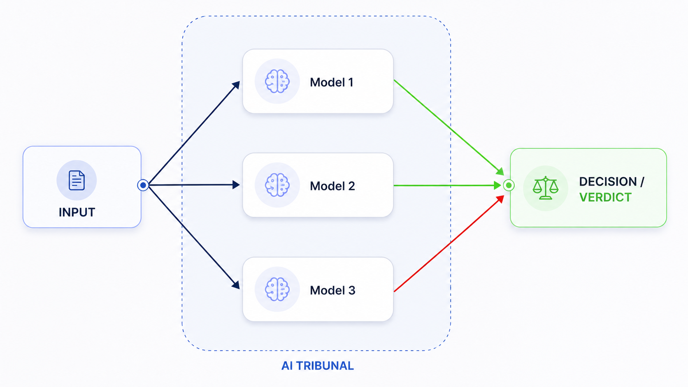
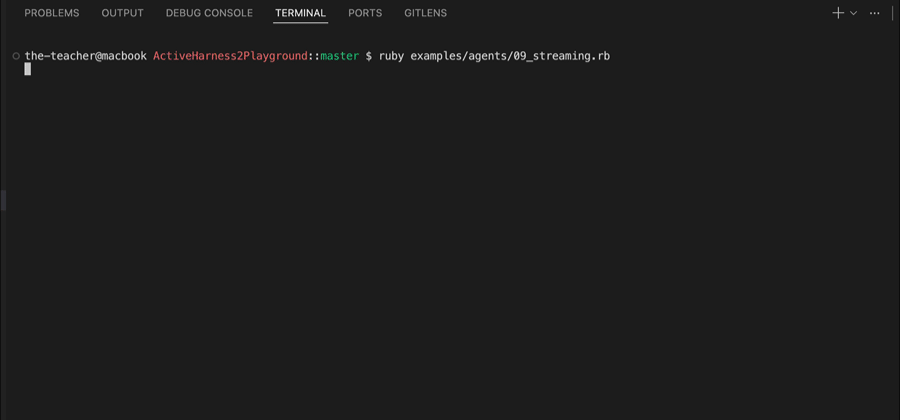

# ActiveHarness

<p align="center">
  
</p>

[](https://rubygems.org/gems/active_harness)

> **⚠️ Work in progress.** The API is under active development and may change between versions without notice.

Running a single LLM call is easy. Running a _reliable, observable, cost-controlled AI system_ is not.

**ActiveHarness** is a Ruby framework for building production-grade LLM pipelines — with deep observability, consensus-based decisions, automatic fallbacks, and real-time cost and timing control. Made for Rails, works in plain Ruby too.

ActiveHarness gem gives you the scaffolding to build multi-step pipelines where every agent is under full control: its inputs are directed, its outputs are observed, its errors are retried, and its cost is tracked. You define the logic; ActiveHarness handles the infrastructure.

## What is a "Harness"?

A **harness** in software is scaffolding that keeps a component under control — directing its inputs, observing its outputs, and enforcing rules around it. **ActiveHarness** does exactly that for LLM agents.

## Build AI-Based Pipelines!

Build multi-step, trackable, cost-effective, and reliable AI flows with a clean, Rails-native DSL.


## Build Nested AI Pipelines!

Group related steps into reusable sub-pipelines, and compose complex workflows from smaller ones. Each pipeline is just another step, with its own stop conditions, context forwarding, and execution time tracking.


## Compose Hybrid Pipelines!

Orchestrate deterministic and AI steps together.


## Control the Cost of Your AI Calls!

With ActiveHarness you can track time, tokens, and dollars for every agent call, pipeline step, and tribunal.


| Cost in Application                                                                                       | Provider's Cost                                                                                            |
| --------------------------------------------------------------------------------------------------------- | ---------------------------------------------------------------------------------------------------------- |
|  |  |

## Use Consensus-Based Decisions!

Use `Tribunals` to run multiple agents in parallel and make `Verdicts` based on their agreement — improving **reliability** and reducing **biases** and **hallucinations**.




## Provide Event Tracing & Observability!

Use power of event hooks to log and trace every step of your AI flows, from individual agent calls to multi-step pipelines and parallel tribunals.

| Event Tracing Architecture                      | Grafana Dashboard                           |
| ----------------------------------------------- | ------------------------------------------- |
|  |  |

**Backend Agnostic** — Built on OpenTelemetry, ready for any collector (Jaeger, Datadog, Honeycomb, or custom).

## Use Memory to make your agents stateful!

Store conversation history in `JSON`, `SQLite` and `PostgreSQL`. Inject memory into prompts to make agents that remember past interactions.


## Visualize Models' Cost and Type


## Add Streaming (SSE)!

| Rails App                                | Console                                 |
| ---------------------------------------- | --------------------------------------- |
|  |  |

## Key Capabilities

| Capability                              | What it means                                                                                               |
| --------------------------------------- | ----------------------------------------------------------------------------------------------------------- |
| **Multi-step&nbsp;Pipelines**           | Chain agents sequentially, with per-step stop conditions and context forwarding                             |
| **Tribunal&nbsp;Consensus**             | Run multiple agents in parallel and accept the result only if they agree (unanimous, majority, or custom)   |
| **Automatic&nbsp;Fallbacks**            | If a model fails, the next one in the chain takes over — zero extra code                                    |
| **Retry&nbsp;Policy**                   | Exponential backoff per model, globally configurable or per-agent                                           |
| **Full&nbsp;Observability**             | Lifecycle hooks on every agent event: `before_call`, `after_call`, `retry`, `failure` — log, stream, or act |
| **Real-time&nbsp;Streaming**            | SSE-ready token streaming from any agent into your Rails response                                           |
| **Execution&nbsp;Time&nbsp;Tracking**   | Per-agent and per-pipeline timing built in                                                                  |
| **Token&nbsp;&nbsp;Cost&nbsp;Tracking** | Know exactly what each call cost in tokens and dollars                                                      |
| **Rails-native&nbsp;DSL**               | Clean file structure, Railtie integration, generator support                                                |
| **Event&nbsp;Tracing**                  | OpenTelemetry integration for distributed tracing of agents, tribunals, and pipelines                       |

## File Structure

File structure for Ruby and Ruby on Rails applications:

Place all of your AI-related code in `app/ai` to keep it organized and separate from your core application logic. You can further organize it into subdirectories for prompts, agents, tribunals, pipelines, and memory.

```
app/
├── models/
├── controllers/
├── views/
└── ai/
    ├── prompts/      # system prompt classes
    ├── agents/       # agent classes
    ├── tribunals/    # parallel verdict panels
    ├── pipelines/    # multi-step pipelines
    └── memory/       # custom memory classes
```

## Prompt Documentation

- [How Prompts Work](docs/PROMPTS.md#how-prompts-work)
- [Minimal Prompt](docs/PROMPTS.md#minimal-prompt)
- [Multi-line Prompt](docs/PROMPTS.md#multi-line-prompt)
- [Dynamic Content with @context](docs/PROMPTS.md#dynamic-content-with-context)
- [Tuning with @params](docs/PROMPTS.md#tuning-with-params)
- [Using @input in the Prompt](docs/PROMPTS.md#using-input-in-the-prompt)
- [JSON Output Prompt](docs/PROMPTS.md#json-output-prompt)
- [Using @memory for Conversation History](docs/PROMPTS.md#using-memory-for-conversation-history)
- [Respecting @context_window](docs/PROMPTS.md#respecting-context_window)
- [Generator](docs/PROMPTS.md#generator)

## Agent Documentation

- [How to Create Your First Agent in 5 Minutes](docs/AGENTS.md#how-to-create-your-first-agent-in-5-minutes)
- [How to Provide Fallbacks](docs/AGENTS.md#how-to-provide-fallbacks)
- [Model Options](docs/AGENTS.md#model-options)
- [Modifying the Model Chain at Runtime](docs/AGENTS.md#modifying-the-model-chain-at-runtime)
- [How to Track Retries and Failures](docs/AGENTS.md#how-to-track-retries-and-failures)
- [How to Use with RubyLLM](docs/AGENTS.md#how-to-use-with-rubyllm)
- [JSON Output and Parsing](docs/AGENTS.md#json-output-and-parsing)
- [Lifecycle Events](docs/AGENTS.md#lifecycle-events)
- [Custom Providers](docs/AGENTS.md#custom-providers)
- [Streaming in the Console](docs/AGENTS.md#streaming-in-the-console)
- [Streaming in a Rails App](docs/AGENTS.md#streaming-in-a-rails-app)
- [Image Generation](docs/agents/image_generation.md)

## Pipeline Documentation

- [How to Create Your First Pipeline in 5 Minutes](docs/PIPELINES.md#how-to-create-your-first-pipeline-in-5-minutes)
- [Step Types](docs/PIPELINES.md#step-types)
- [Stop Conditions](docs/PIPELINES.md#stop-conditions)
- [Tribunal Step](docs/PIPELINES.md#tribunal-step)
- [Context: Accessing Previous Step Results](docs/PIPELINES.md#context-accessing-previous-step-results)
- [Lifecycle Events](docs/PIPELINES.md#lifecycle-events)
- [Event Streams](docs/PIPELINES.md#event-streams)
- [Full Example](docs/PIPELINES.md#full-example)

## Nested Pipelines Documentation

- [How It Works](docs/NESTED_PIPLINES.md#how-it-works)
- [Minimal Example](docs/NESTED_PIPLINES.md#minimal-example)
- [Stopping the Outer Pipeline from the Inside](docs/NESTED_PIPLINES.md#stopping-the-outer-pipeline-from-the-inside)
- [transform — Why It Is Required](docs/NESTED_PIPLINES.md#transform--why-it-is-required)
- [Accessing Inner Results from the Outer Context](docs/NESTED_PIPLINES.md#accessing-inner-results-from-the-outer-context)
- [Event Streams](docs/NESTED_PIPLINES.md#event-streams)
- [Multiple Levels of Nesting](docs/NESTED_PIPLINES.md#multiple-levels-of-nesting)
- [Reference](docs/NESTED_PIPLINES.md#reference)

## Tribunal Documentation

- [How to Create Your First Tribunal in 5 Minutes](docs/TRIBUNALS.md#how-to-create-your-first-tribunal-in-5-minutes)
- [Tribunal from Different Agents](docs/TRIBUNALS.md#tribunal-from-different-agents)
- [Verdict Strategies](docs/TRIBUNALS.md#verdict-strategies)
- [Custom Verdict Logic](docs/TRIBUNALS.md#custom-verdict-logic)
- [Tolerating Partial Failures](docs/TRIBUNALS.md#tolerating-partial-failures)
- [Same Agent, Different Models](docs/TRIBUNALS.md#same-agent-different-models)
- [Runtime Model Prepend per Agent](docs/TRIBUNALS.md#runtime-model-prepend-per-agent)
- [Direct Usage](docs/TRIBUNALS.md#direct-usage)
- [Lifecycle Events](docs/TRIBUNALS.md#lifecycle-events)

## Memory Documentation

- [How Memory Works](docs/MEMORY.md#how-memory-works)
- [JsonFile Memory](docs/MEMORY.md#jsonfile-memory)
- [Custom Memory Class](docs/MEMORY.md#custom-memory-class)
- [Managing Memory via Agent Callbacks](docs/MEMORY.md#managing-memory-via-agent-callbacks)
- [Injection Patterns](docs/MEMORY.md#injection-patterns)
- [Filtering History with to_messages](docs/MEMORY.md#filtering-history-with-to_messages)
- [Memory API Reference](docs/MEMORY.md#memory-api-reference)
- [Memory with namespace:](docs/MEMORY.md#memory-with-namespace)
- [Sharing Memory Across Pipeline Steps](docs/MEMORY.md#sharing-memory-across-pipeline-steps)
- [PostgreSQL Backend](docs/MEMORY.md#postgresql-backend)
- [SQLite Backend](docs/MEMORY.md#sqlite-backend)

## Installation and Configuration

- [Installation](docs/INSTALLATION.md#installation)
- [Rails Setup](docs/INSTALLATION.md#rails-setup)
- [Plain Ruby Setup](docs/INSTALLATION.md#plain-ruby-setup)
- [Configuration](docs/INSTALLATION.md#configuration)
- [Providers Reference](docs/INSTALLATION.md#providers-reference)
- [Global Settings](docs/INSTALLATION.md#global-settings)
- [Generators](docs/INSTALLATION.md#generators)

## Tracing and Observability

- [How It Works](docs/TRACING.md#how-it-works)
- [Simple Logging with Hooks](docs/TRACING.md#simple-logging-with-hooks)
- [OpenTelemetry Setup](docs/TRACING.md#opentelemetry-setup)
- [AgentTracing Concern](docs/TRACING.md#agenttracing-concern)
- [TribunalTracing Concern](docs/TRACING.md#tribunaltracing-concern)
- [PipelineTracing Concern](docs/TRACING.md#pipelinetracing-concern)
- [Span Hierarchy](docs/TRACING.md#span-hierarchy)
- [Connecting to a Backend](docs/TRACING.md#connecting-to-a-backend)

## License

MIT © [the-teacher](https://github.com/the-teacher)
