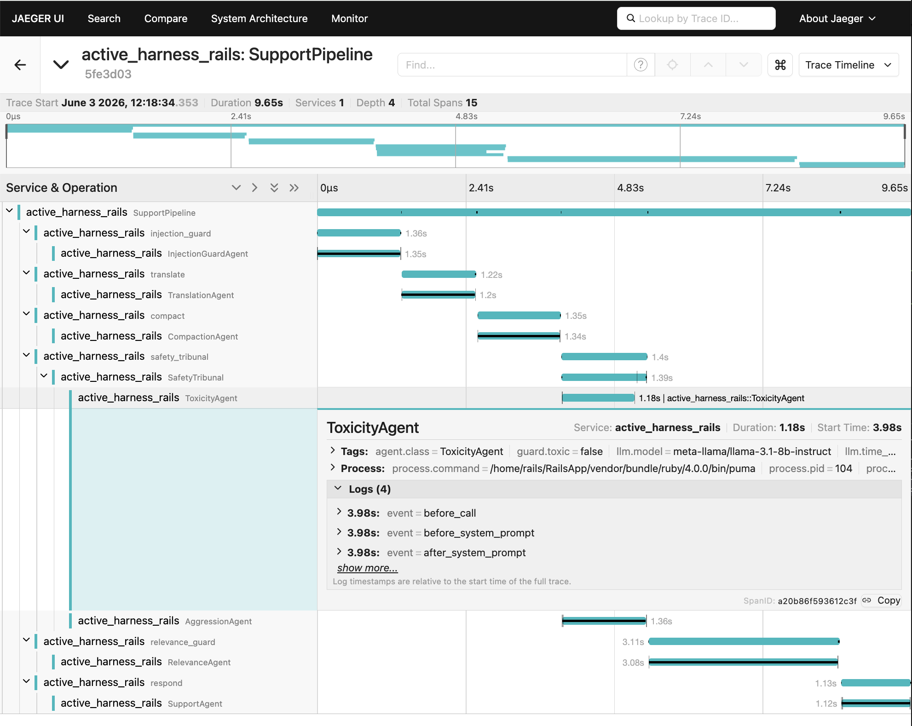
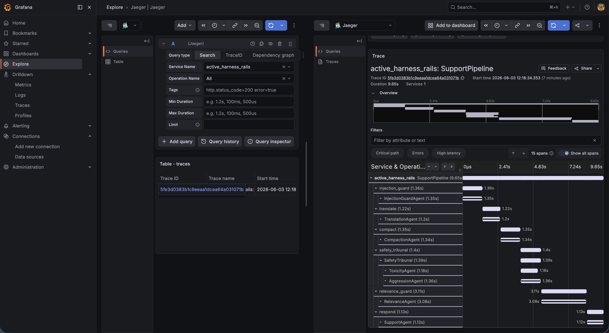
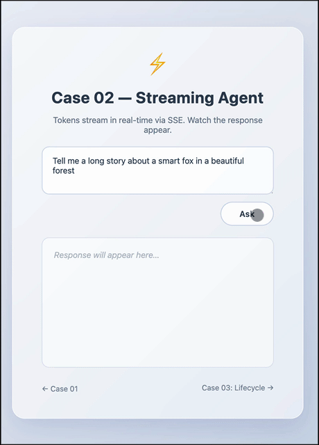

# ActiveHarness

<p align="center">
  
</p>

[](https://rubygems.org/gems/active_harness)

> **⚠️ Work in progress.** The API is under active development and may change between versions without notice.

**ActiveHarness** is a Ruby framework for building production-grade LLM pipelines — with deep observability, consensus-based decisions, automatic fallbacks, and real-time cost and timing control. Made for Rails, works in plain Ruby too.

Running a single LLM call is easy. Running a _reliable, observable, cost-controlled AI system_ is not.

ActiveHarness gem gives you the scaffolding to build multi-step pipelines where every agent is under full control: its inputs are directed, its outputs are observed, its errors are retried, and its cost is tracked. You define the logic; ActiveHarness handles the infrastructure.

## What is a "Harness"?

A **harness** in software is scaffolding that keeps a component under control — directing its inputs, observing its outputs, and enforcing rules around it. **ActiveHarness** does exactly that for LLM agents.

## Build AI-Based Pipelines!

Build multi-step, trackable, cost-effective, and reliable AI flows with a clean, Rails-native DSL.


## Use Consensus-Based Decisions!

Use **Tribunals** to run multiple agents in parallel and make `Verdicts` based on their agreement — improving **reliability** and reducing **biases** and **hallucinations**.


## Provide Event Tracing & Observability

Use power of event hooks to log and trace every step of your AI flows, from individual agent calls to multi-step pipelines and parallel tribunals.

| Event Tracing Architecture               | Grafana Dashboard                    |
| ---------------------------------------- | ------------------------------------ |
|  |  |

## Use Memory to make your agents stateful!

Store conversation history in JSON, SQLite and PostgreSQL. Inject memory into prompts to make agents that remember past interactions.


## Add Streaming (SSE)!

| Rails App                         | Console                          |
| --------------------------------- | -------------------------------- |
|  |  |

**What you get out of the box:**

| Capability                              | What it means                                                                                               |
| --------------------------------------- | ----------------------------------------------------------------------------------------------------------- |
| **Multi-step&nbsp;Pipelines**           | Chain agents sequentially, with per-step stop conditions and context forwarding                             |
| **Tribunal&nbsp;Consensus**             | Run multiple agents in parallel and accept the result only if they agree (unanimous, majority, or custom)   |
| **Automatic&nbsp;Fallbacks**            | If a model fails, the next one in the chain takes over — zero extra code                                    |
| **Retry&nbsp;Policy**                   | Exponential backoff per model, globally configurable or per-agent                                           |
| **Full&nbsp;Observability**             | Lifecycle hooks on every agent event: `before_call`, `after_call`, `retry`, `failure` — log, stream, or act |
| **Real-time&nbsp;Streaming**            | SSE-ready token streaming from any agent into your Rails response                                           |
| **Execution&nbsp;Time&nbsp;Tracking**   | Per-agent and per-pipeline timing built in                                                                  |
| **Token&nbsp;&nbsp;Cost&nbsp;Tracking** | Know exactly what each call cost in tokens and dollars                                                      |
| **Rails-native&nbsp;DSL**               | Clean file structure, Railtie integration, generator support                                                |
| **Event&nbsp;Tracing**                  | OpenTelemetry integration for distributed tracing of agents, tribunals, and pipelines                       |

## Event Tracing & Observability

ActiveHarness ships with production-ready distributed tracing to monitor AI execution flows across your application.

| Event Tracing Architecture               | Grafana Dashboard                    |
| ---------------------------------------- | ------------------------------------ |
|  |  |

**Backend Agnostic** — Built on OpenTelemetry, ready for any collector (Jaeger, Datadog, Honeycomb, or custom).

## File Structure

File structure for Ruby and Ruby on Rails applications:

```
app/
├── models/
├── controllers/
├── views/
└── ai/
    ├── prompts/      # system prompt classes
    ├── agents/       # agent classes
    ├── tribunals/    # parallel verdict panels
    ├── pipelines/    # multi-step pipelines
    └── memory/       # custom memory classes
```

## License

MIT © [the-teacher](https://github.com/the-teacher)
