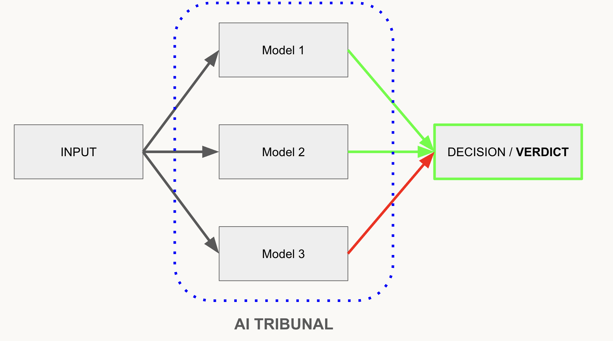

# ActiveHarness

<p align="center">
  
</p>

[](https://rubygems.org/gems/active_harness)

> **⚠️ Work in progress.** The API is under active development and may change between versions without notice.

**ActiveHarness** is a Ruby framework for building AI agents with multiple LLM providers, lifecycle hooks, and a simple DSL. Made for Rails but works in plain Ruby too.

## What is a "Harness"?

A **harness** in software is scaffolding that keeps a component under control — directing its inputs, observing its outputs, and enforcing rules around it. **ActiveHarness** does exactly that for AI agents.

## Why Did I Build This?

I build relately complex AI piplines for my Ruby and Ruby on Rails projects and I needed a way to:

- Organize prompts, agents, and pipelines in a clean, reusable way.
- Automatically fallback to another model if one fails, without writing extra code for retries and error handling.
- Have a way to validate results by running multiple agents in parallel and comparing their outputs. (See "Tribunals" below.)
- Have a way to catch events in the agent lifecycle — for logging, debugging, or modifying the flow.

So this solution was born out.

### Table of Contents

- [Setup API Keys](#api-keys)
- [Configuration](#configuration)
- [Retry Policy](#retry-policy)
- [Ruby on Rails File Structure](#file-structure)
- [Prompts. How to Create](#prompts)
- [Agents. How to Create](#agents)
- [Tribunals. How to Create](#tribunals)
- [Pipelines. How to Create](#pipelines)
- [Memory. How to Create](#memory)
- [Using with Ruby on Rails](#using-with-ruby-on-rails)
- [Streaming (SSE)](#streaming-sse)
- [Execution Time](#execution-time)
- [Token Usage Info](#token-usage-info)

## API Keys

Each provider reads its key from an environment variable. Set only the keys for the providers you intend to use.

| Provider       | Environment variable                                                          |
| -------------- | ----------------------------------------------------------------------------- |
| OpenAI         | `OPENAI_API_KEY`                                                              |
| Anthropic      | `ANTHROPIC_API_KEY`                                                           |
| Google Gemini  | `GEMINI_API_KEY`                                                              |
| Groq           | `GROQ_API_KEY`                                                                |
| OpenRouter     | `OPENROUTER_API_KEY`                                                          |
| xAI (Grok)     | `XAI_API_KEY`                                                                 |
| DeepSeek       | `DEEPSEEK_API_KEY`                                                            |
| Mistral        | `MISTRAL_API_KEY`                                                             |
| Ollama (local) | `OLLAMA_API_BASE` (optional, default: localhost)                              |
| Perplexity     | `PERPLEXITY_API_KEY`                                                          |
| GPUStack       | `GPUSTACK_API_BASE`, `GPUSTACK_API_KEY` (optional)                            |
| Azure OpenAI   | `AZURE_API_BASE`, `AZURE_API_KEY` (or `AZURE_AI_AUTH_TOKEN`)                  |
| Custom         | `config.custom["Name"]["url"]`, `config.custom["Name"]["api_key"]` (optional) |

For a plain Ruby project, export variables in your shell or load them from a `.env` file with `dotenv`:

```bash
export OPENAI_API_KEY="sk-..."
export OPENROUTER_API_KEY="sk-or-..."
```

For Rails, store keys in `config/credentials.yml.enc` or use a `.env` file with the `dotenv-rails` gem.

## Configuration

ActiveHarness supports a Rails-style `configure` block for setting API keys and provider URLs in one place. ENV variables are used as defaults if `configure` is not called — so existing setups keep working without changes.

- [Configuration in plain Ruby →](docs/ruby_configuration.md)
- [Configuration in Ruby on Rails →](docs/rails_configuration.md)

```ruby
# Quick example
ActiveHarness.configure do |config|
  config.openai_api_key    = ENV["OPENAI_API_KEY"]
  config.anthropic_api_key = ENV["ANTHROPIC_API_KEY"]
  config.openrouter_http_referer = "https://my-app.com"

  # Retry policy (global defaults)
  config.retry_default_attempts = 3    # total attempts per model
  config.retry_default_delay    = 1.0  # seconds before 1st retry; doubles each round

  # Register any OpenAI-compatible endpoint under a custom name
  config.custom["MyLocal"]["url"]     = "http://localhost:8080/v1/chat/completions"
  config.custom["MyLocal"]["api_key"] = ENV["MYLOCAL_API_KEY"]  # omit if no auth
end
```

Use a custom provider in an agent:

```ruby
model do
  use      provider: :custom, name: "MyLocal",     model: "llama3.2"
  fallback provider: :openai,                       model: "gpt-4o-mini"
end
```

## Retry Policy

When a model returns a transient error (`TimeoutError`, `RateLimitError`, `ServerError`, `ProviderUnavailableError`), ActiveHarness automatically retries the **same model** with exponential backoff before moving to the next fallback.

```
model A → retry 1 (1s) → retry 2 (2s) → FAIL → model B (fallback) → SUCCESS
```

**Global defaults** (apply to all models unless overridden):

```ruby
ActiveHarness.configure do |config|
  config.retry_default_attempts = 3    # total attempts per model (default: 3)
  config.retry_default_delay    = 1.0  # seconds before 1st retry; doubles each round (default: 1.0)
end
```

Disable retries entirely:

```ruby
config.retry_default_attempts = 1  # one attempt — fail immediately to next fallback
```

**Per-model override** — set `retry_attempts:` and `retry_delay:` in the model DSL:

```ruby
model do
  use      provider: :openai, model: "gpt-4.1",
           retry_attempts: 5, retry_delay: 2.0   # up to 5 attempts, 2s → 4s → 8s…

  fallback provider: :groq,   model: "llama3-8b-8192",
           retry_attempts: 2, retry_delay: 0.5   # fast fallback

  fallback provider: :ollama, model: "llama3.2"
  # ↑ uses global retry_default_attempts / retry_default_delay
end
```

Backoff formula: `delay × 2^(attempt − 1)` — with `retry_delay: 1.0` and 3 attempts: **1s → 2s → fail → next fallback**.

Errors that are **never** retried (stop the chain immediately): `InvalidApiKeyError`, `SafetyBlockedError`.

## File Structure

File structure for Ruby and Ruby on Rails applications:

```
app/
├── models/
├── controllers/
├── views/
└── ai/
    ├── prompts/      # system prompt classes
    ├── agents/       # agent classes
    ├── tribunals/    # parallel verdict panels
    ├── pipelines/    # multi-step pipelines
    └── memory/       # custom memory classes
```

# Components of the ActiveHarness ecosystem:

## Prompts

A **prompt** is a plain Ruby class with a `call` method that returns the system prompt string.

Before `call` is invoked, the agent automatically injects `@input`, `@context`, and `@config` —
so you can build dynamic prompts without any extra wiring.

```ruby
class SupportPrompt
  def call
    "You are a concise and friendly customer support assistant. " \
    "Answer briefly, in 2-3 sentences max." \
    + reply_in_language
  end

  private

  def reply_in_language
    return "" unless @context[:language]
    " (reply in #{@context[:language]})"
  end
end
```

## Agents

An **agent** is a single LLM call wrapped in a class. It declares a system prompt, a model chain with automatic fallbacks, and lifecycle hooks for observing or modifying every stage of the call.

→ [Agent hooks reference](docs/agent_hooks.md)

```ruby
class SupportAgent < ActiveHarness::Agent
  system_prompt SupportPrompt

  # Models are tried in order.
  # If one fails, the next fallback is used automatically.
  model do
    use  provider: :openrouter,
         model: "mistralai/mistral-nemo",
         temperature: 0.5

    fallback provider: :openai,    model: "gpt-4o-mini"
    fallback provider: :anthropic, model: "claude-3-haiku-20240307",
             retry_attempts: 2, retry_delay: 0.5  # per-model retry override
    fallback provider: :groq,      model: "llama-3.1-8b-instant"
    fallback provider: :gemini,    model: "gemini-2.0-flash"
  end

  # Save tokens
  # Trim user input whitespace and normalize spaces before the call.
  callback :setup do
    @input = @input&.strip&.gsub(/\s+/, " ")
  end

  before :call do
    if @context[:language]
      suffix = " (reply in #{@context[:language]})"
      @input += suffix unless @input.end_with?(suffix)
    end
  end

  callback :retry do |entry, error|
    puts "[retry] #{entry[:model]} — #{error.message}"
  end

  callback :failure do |attempts|
    puts "[failure] all #{attempts.size} models failed"
  end
end
```

**Usage:**

```ruby
agent = SupportAgent.new
agent.input   = "What is your return policy?"
agent.context = { language: "English" }
agent.call

result = agent.result

puts result.output                     # => "Our return policy is..."
puts result.model                      # => "mistralai/mistral-nemo"
puts result.execution_time             # => 1.352  (seconds)

# If providers return token usage info, it's all here:
puts result.usage[:input_tokens]       # => 41
puts result.usage[:output_tokens]      # => 78
puts result.usage[:total_tokens]       # => 119
```

`call` returns `self`, so calls can be chained:

```ruby
result = SupportAgent.new.tap { |a| a.input = "Hi" }.call.result
```

## Tribunals



A **tribunal** runs several agents on the same input **in parallel** and produces a single consensus **VERDICT** (final decision).

This improves reliability — a single model can be wrong or biased, but two (or more) independent models rarely agree on the same mistake.

→ [Tribunal hooks reference](docs/tribunal_hooks.md)

**Prompt** — each agent returns structured JSON:

```ruby
class PolitenessPrompt
  def call
    <<~PROMPT.strip
      You are a politeness evaluator.
      Analyze the message and decide whether it is polite.
      Reply ONLY with valid JSON, no markdown:
      {"result": true, "reason": "..."}
    PROMPT
  end
end
```

**Agent** — uses the prompt and parses JSON output automatically:

```ruby
class PolitenessAgent < ActiveHarness::Agent
  system_prompt PolitenessPrompt

  # Parse the raw string output into a JSON object
  # Parsed results are available on result.parsed
  format :json

  # default model chain with fallbacks
  model do
    use      provider: :openrouter, model: "mistralai/mistral-nemo"
    fallback provider: :openrouter, model: "meta-llama/llama-3.1-8b-instruct"
  end
end
```

**Tribunal** — runs two instances of the agent on different models, verdict is `true` only if both agree:

```ruby
class PolitenessTribunal < ActiveHarness::Tribunal
  def initialize(input:)
    # Two independent agents with different models, running in parallel.
    agent_1 = PolitenessAgent.new
    agent_1.models.prepend([{ provider: :openai, model: "gpt-4o-mini" }])

    agent_2 = PolitenessAgent.new
    agent_2.models.prepend([{ provider: :anthropic, model: "claude-3-haiku-20240307" }])

    super(
      input: input,
      agents: [agent_1, agent_2]
    )
  end

  # Define how the tribunal makes a VERDICT based on all agents' results.
  process do |results|
    results.all? do |result|
      result.parsed["result"] == true
    end
  end
end
```

**Usage:**

```ruby
aggressive_message = "I hate this product! It is the worst thing I've ever bought!!!"

politeness_tribunal = PolitenessTribunal.new

politeness_tribunal.input = aggressive_message
politeness_tribunal.call

puts politeness_tribunal.verdict          # => false
puts politeness_tribunal.execution_time   # => 0.94  (both agents ran in parallel)

# Inspect each agent's reasoning:
politeness_tribunal.results.each do |result|
  puts result.model                        # => "gpt-4o-mini"
  puts result.parsed["result"]             # => false
  puts result.parsed["reason"]             # => "The message contains aggressive language..."
end
```

## Pipelines

A **pipeline** chains agents and tribunals into a sequential, multi-step flow. Each step receives the output of the previous step as its input. Any step can stop the pipeline early — the remaining steps are skipped.

→ [Pipeline hooks reference](docs/pipeline_hooks.md)

```ruby
class SupportPipeline < ActiveHarness::Pipeline
  # Step 1 — Guard: detect prompt injection before wasting tokens.
  # stop_if receives the result and halts the pipeline if true.
  step :injection_guard do
    use InjectionGuardAgent
    stop_if ->(result) { result.parsed["detected"] == true }
  end

  # Step 2 — Shorthand: no stop_if, always continues.
  step :translate, TranslationAgent

  # Step 3 — Tribunal as a step: parallel safety check.
  step :safety_tribunal do
    use PolitenessTribunal
    stop_if ->(result) { result.verdict == false }
  end

  # Step 4 — Final answer on a clean, safe, on-topic request.
  step :respond, SupportAgent

  # ~~~ Global hooks — fire on every step ~~~

  before :step do |step_name, payload|
    puts "[pipeline] → :#{step_name}"
  end

  after :step do |step_name, result|
    puts "[pipeline] ✓ :#{step_name} (#{result.execution_time}s)"
  end

  # ~~~ Per-step hook — fires only for :injection_guard ~~~

  after :step, :injection_guard do |result|
    status = result.parsed["detected"] ? "INJECTION DETECTED" : "clean"
    puts "[injection_guard] #{status}: #{result.parsed["reason"]}"
  end

  # ~~~ Terminal hooks ~~~

  callback :stopped do |step_name, result|
    puts "[pipeline] STOPPED at :#{step_name}"
  end

  callback :complete do |last_result|
    puts "[pipeline] complete"
  end
end
```

**Call:**

```ruby
pipeline = SupportPipeline.new
pipeline.input = "What is your return policy?"
pipeline.call

if pipeline.stopped?
  puts pipeline.stopped_at    # => :injection_guard  (name of the step that stopped it)
else
  puts pipeline.output        # => "Our return policy is..."
end

puts pipeline.execution_time  # => 3.12  (total wall time for all steps)

# Individual step results:
pipeline.step_results.each do |step_name, result|
  puts "#{step_name}: #{result.execution_time}s"
end
```

## Memory

**Memory** records the conversation history (request + response turns) for an agent session.
Recording is automatic — you only need to pass a `memory:` object when constructing an agent.
**Injection is always manual** — you decide when and how past turns are included in the prompt.

**Custom memory class** — wrap `ActiveHarness::Memory` once with your application defaults:

```ruby
class AppMemory < ActiveHarness::Memory
  STORAGE_PATH = Rails.root.join("storage/ai/memory").freeze

  def initialize(session_id:)
    super(
      session_id:   session_id,
      depth:        10,          # how many turns to keep in memory
      adapter:      :file,
      path:         STORAGE_PATH,
      storage_size: 200,         # max chars per stored message
      pretty:       true
    )
  end
end
```

**Wire memory to an agent** — pass it at construction time:

```ruby
memory = AppMemory.new(session_id: "user_42")

agent = SupportAgent.new(
  context: { language: "English" },
  memory:  memory
)

agent.call("What is your return policy?")
agent.call("Does that apply to digital products too?")
agent.call("How long does a refund take?")

puts memory.size          # => 3  (one turn per call)
```

To **inject history into the prompt**, read `@memory` inside the prompt class:

```ruby
class SupportPrompt
  def call
    base = "You are a concise and friendly customer support assistant."

    return base unless @memory&.size&.positive?

    history = @memory.to_messages
                     .map { |m| "#{m[:role]}: #{m[:content]}" }
                     .join("\n")

    "#{base}\n\nConversation so far:\n#{history}"
  end
end
```

`@memory`, `@input`, and `@context` are all injected into the prompt automatically before `call` is invoked.

## Using with Ruby on Rails

<details>
<summary><strong>How to install and use with Rails</strong></summary>

### 1. Add the gem

```ruby
# Gemfile
gem "active_harness"
```

```bash
bundle install
```

### 2. Set API keys

Add `dotenv-rails` to your Gemfile:

```ruby
gem "dotenv-rails"
```

```bash
bundle install
```

Create `.env` in Rails root and add it to `.gitignore`:

```bash
# .env
OPENAI_API_KEY=sk-...
ANTHROPIC_API_KEY=sk-ant-...
GEMINI_API_KEY=...
GROQ_API_KEY=...
OPENROUTER_API_KEY=sk-or-v1-...
```

```bash
echo ".env" >> .gitignore
```

Set only the keys for the providers you use.

### 3. Run the install generator

```bash
rails generate active_harness:install
```

This creates the `app/ai/` directory structure with example classes, a controller, and routes.  
Files are only created if they don't already exist — running the generator on an existing project is safe.

```
app/
└── ai/
    ├── agents/
    │   ├── support_agent.rb
    │   └── support_guard_agent.rb
    ├── prompts/
    │   ├── support_prompt.rb
    │   └── support_guard_prompt.rb
    ├── tribunals/
    │   └── support_guard_tribunal.rb
    ├── pipelines/
    │   └── support_pipeline.rb
    └── memory/
        └── app_memory.rb
app/controllers/
    └── ai_support_controller.rb
```

Routes injected into `config/routes.rb`:

```
POST /ai/agent          — single agent call
POST /ai/agent_memory   — agent call with session memory
POST /ai/tribunal       — content moderation check
POST /ai/pipeline       — full pipeline run
GET  /ai/agent_stream   — streaming response (SSE)
```

### 4. Try it

```bash
curl -s -X POST http://localhost:3000/ai/agent \
  -H "Content-Type: application/json" \
  -d '{"input": "Hello!"}'

# {"output":"Hi, how can I assist you today?","model":"mistralai/mistral-nemo","time":2.862}
```

### Generators

Generate individual components by name:

```
rails generate active_harness:prompt   Support
rails generate active_harness:agent    Support
rails generate active_harness:tribunal Politeness
rails generate active_harness:pipeline Support
rails generate active_harness:memory   App
```

| Command                        | File created                        |
| ------------------------------ | ----------------------------------- |
| `active_harness:prompt Name`   | `app/ai/prompts/name_prompt.rb`     |
| `active_harness:agent Name`    | `app/ai/agents/name_agent.rb`       |
| `active_harness:tribunal Name` | `app/ai/tribunals/name_tribunal.rb` |
| `active_harness:pipeline Name` | `app/ai/pipelines/name_pipeline.rb` |
| `active_harness:memory Name`   | `app/ai/memory/name_memory.rb`      |

### Autoloading

All files under `app/ai/` are autoloaded automatically — no `require` calls needed.

</details>

## Streaming (SSE)


To stream responses token by token, include `ActionController::Live` and pass a `stream:` lambda to the agent:

```ruby
class AiController < ApplicationController
  include ActionController::Live

  # GET /ai/stream?input=What+is+your+return+policy%3F
  def stream
    input = params.require(:input)

    response.headers["Content-Type"]      = "text/event-stream"
    response.headers["Cache-Control"]     = "no-cache"
    response.headers["X-Accel-Buffering"] = "no"  # disable nginx buffering

    sse = ActionController::Live::SSE.new(response.stream, event: "message")

    SupportAgent.call(
      input:  input,
      stream: ->(token) { sse.write({ token: token }.to_json) }
    )

    sse.write({ done: true }.to_json)
  rescue ActionController::Live::ClientDisconnected
    # client closed the connection — nothing to do
  ensure
    sse.close
  end
end
```

**JavaScript client:**

```js
const es = new EventSource("/ai/stream?input=Hello");

es.onmessage = ({ data }) => {
  const { token, done } = JSON.parse(data);
  if (done) {
    es.close();
    return;
  }
  document.querySelector("#output").insertAdjacentText("beforeend", token);
};
```

Each SSE frame carries one token: `data: {"token":"Hello"}`. The final frame: `data: {"done":true}`.

## Execution Time

Every object that makes an LLM call exposes `#execution_time` (seconds, rounded to 3 decimal places).

```ruby
# Agent — execution_time is on the result
agent.call
puts agent.result.execution_time    # => 1.352

# Tribunal — wall time for all agents running in parallel
tribunal.call
puts tribunal.execution_time        # => 0.94

# Pipeline — total wall time across all steps that ran
pipeline.call
puts pipeline.execution_time        # => 3.12

# Per step
pipeline.step_results.each do |step_name, result|
  puts "#{step_name}: #{result.execution_time}s"
end
```

## Token Usage Info

When a provider returns token counts, they are available on the `Result` object under `#usage`.  
Not all providers return usage — the value is `nil` for streaming calls and some free-tier models.

```ruby
agent.call
result = agent.result

if result.usage
  puts result.usage[:input_tokens]   # => 41
  puts result.usage[:output_tokens]  # => 78
  puts result.usage[:total_tokens]   # => 119
end
```

For a tribunal, inspect each agent's result individually:

```ruby
tribunal.call

tribunal.results.each do |result|
  puts "#{result.model}: #{result.usage&.dig(:total_tokens)} tokens"
end
```

## License

MIT © [the-teacher](https://github.com/the-teacher)
